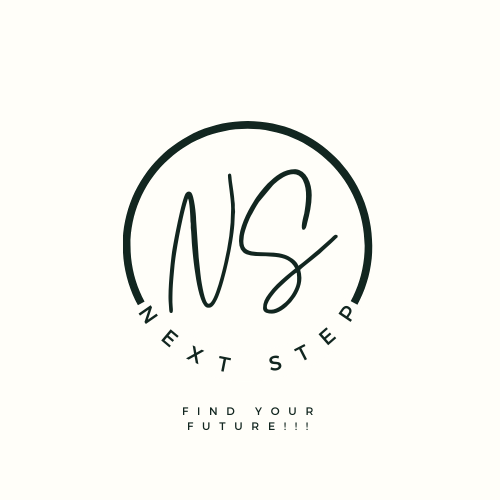

   

# Next Step

Next Step is an interactive website that allows users to experience a choose-your-own-adventure while navigating through decisions in regards to their career and life path. Our approach gives users (student in particular) and more hands-on method to visualize possible paths and better understand their options.

Next Step was built primarily using HTML, CSS, and JavaScript. 

## History

Next Step was originally created for the BITS ACM-W Hackathon we participated in the month of Nov 2024 . The Hackathon was college wide and organized by the local chapter of Girls-ACM-W.

We participated in the Intermediate Division and were asked to create something that we felt would improve the education system, based on our own experience. Our concept and website ended up winning 3rd place in our division!

## Creators + Contributors

Created by Matam Padmini, CH Harshitha, & Deepika Budidhi

Having never worked on a project together before, we learned how to collaborate and work together as a team as we worked on this ACM-W Hackathon. 

## Features

- Career Quiz

- Choose-Your-Own Path Interactive Page

- Career Cluster Options

- Path Map and Career Information Page

(MAYBE EXPAND ON THE FEATURES AND MORE ABOUT THEM??)

## For Educators
information for educators

## For Students
help for students

# Future of MyPath

In the future, we would like to refine and add features to our website. If you have any ideas, please feel free to contact us! 

# Notice for public and collaborators

While this repository is open-source and public, we ask that you please respect our project.
If you are a contributer to the project, you must create a branch (not main) to work off of and send a pull request to push the main. One of the Originial Adminstrators will approve your request. If you would like to work on an issue in this Repo, please send a message in the discussion 'For Contributors' and we will assign you an issue to work on.
.

